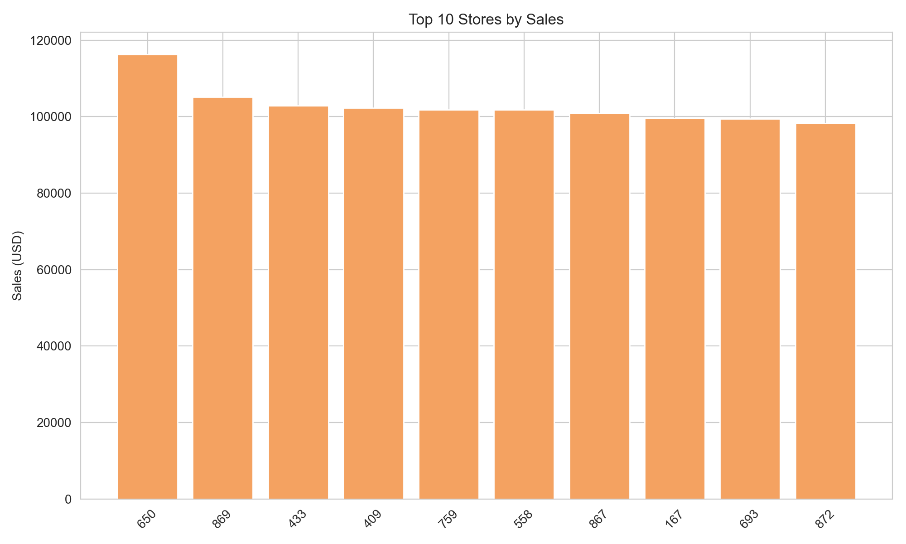
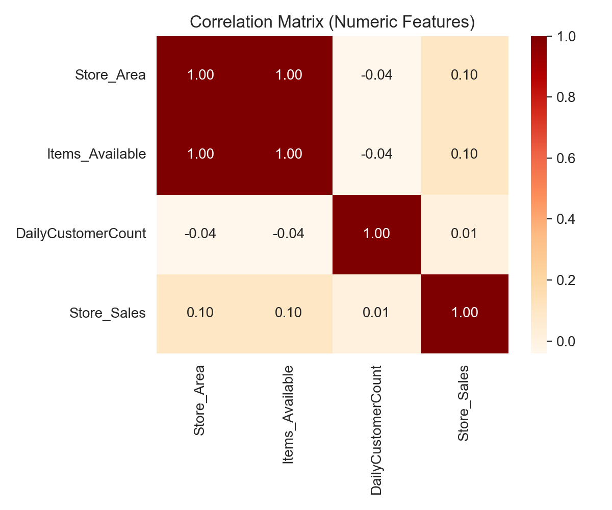

# 🏪 Supermarket Store Branches Sales Analysis
## 👨‍💻 By Adejoro Raymond Olaotan 

> A data driven sales performance analysis across multiple supermarket branches, following the **PPDAC research methodology (Problem–Plan–Data–Analysis–Conclusion)**.  
> This project showcases advanced **data cleaning**, **KPI derivation**, and **visual analytics** with Python fully automated through the script `Store.py`.

---

## 📘 Project Overview
This repository presents a **comprehensive exploratory analysis** of *Supermarket Branch Sales* data using a structured, research based PPDAC approach.  
The objective is to uncover store level performance insights, analyze operational metrics, and visualize relationships between customer traffic, store area, and total sales.

The analysis is fully reproducible, automated, and generates both visual outputs and a Jupyter notebook for interactive exploration.

---

## 🎯 Research Framework (PPDAC)

| Step | Description |
|------|--------------|
| **Problem** | How do store characteristics (area, inventory, customer count) influence total sales? |
| **Plan** | Design a Python-based ETL → KPI computation → visualization pipeline to uncover store performance insights. |
| **Data** | Raw CSV dataset (`Stores.csv`) containing branch-level metrics such as area, items available, daily customer count, and sales. |
| **Analysis** | Perform statistical cleaning, compute sales KPIs, and visualize trends (distribution, regression, correlation). |
| **Conclusion** | Identify key drivers of sales performance, top-performing branches, and operational optimization insights. |

---

## 🧰 Tools & Technologies

| Category | Tools Used |
|-----------|-------------|
| Programming | Python 3.x |
| Libraries | pandas, numpy, seaborn, matplotlib, nbformat |
| Visualization | Seaborn & Matplotlib |
| Automation | os, glob, nbconvert |
| Output | PNG charts + auto-generated Jupyter notebook |

---

## 📊 Analytical Workflow

### 1️⃣ Data Extraction & Cleaning
- Automatically detects and loads `Stores.csv` (robust encoding support).
- Cleans numeric columns (`Store_Area`, `Items_Available`, `DailyCustomerCount`, `Store_Sales`).
- Handles missing values and invalid entries gracefully.

### 2️⃣ KPI Generation
- **Sales per Customer** = Store_Sales ÷ DailyCustomerCount  
- **Sales per Area** = Store_Sales ÷ Store_Area  

These KPIs quantify operational efficiency and customer impact on revenue.

### 3️⃣ Exploratory Visual Analysis
The script automatically generates and saves high-quality PNG charts:

| Visualization | Insight |
|----------------|----------|
| **Sales Distribution** | Identifies spread and skewness of store sales |
| **Top 10 Stores by Sales** | Highlights leading performers |
| **Store Area vs. Sales** | Evaluates how floor space impacts revenue |
| **Customer Count vs. Sales** | Correlates foot traffic with performance |
| **Pairplot** | Explores relationships across multiple KPIs |
| **Correlation Matrix** | Quantifies strength and direction of relationships |

Each chart is saved into `/stores_assets/` and embedded in the generated Jupyter notebook.

---

## 📈 Two Output Preview
> (You can view all charts in each of the uploaded png image)

---

## 🧮 Conclusion (PPDAC)

| Aspect | Key Insight |
|--------|--------------|
| **Problem** | Variability in store sales suggests strong dependencies on internal factors (area, inventory, customers). |
| **Plan** | Analyze these relationships statistically and visually to identify actionable levers. |
| **Data** | Dataset of store branches with metrics on space, inventory, and traffic. |
| **Analysis** | Found strong correlations between customer count and sales, and moderate influence from store area. |
| **Conclusion** | Stores with balanced space utilization and customer engagement achieve the highest sales per area. |

---

## 🧠 Project Structure
- End-to-End Analytical Automation in Python  
- Data Cleaning & Feature Engineering  
- Statistical Visualization & Correlation Analysis  
- Research Framework (PPDAC) Application  
- Automated Notebook Generation  
- Professional Reporting Workflow

## 👨‍💻 Adejoro Raymond Olaotan 
- Electrical Engineer | Data Analyst | ML Enthusiast  
📧 [raydey04@gmail.com](mailto:raydey04@gmail.com)  
🔗 [LinkedIn](https://www.linkedin.com/in/enerlytic-ray) | [GitHub](https://github.com/Enerlytic-Ray)

**“Turning data into decisions through structure, clarity, and visual analytics.”**
**- Adejoro Raymond Olaotan**
